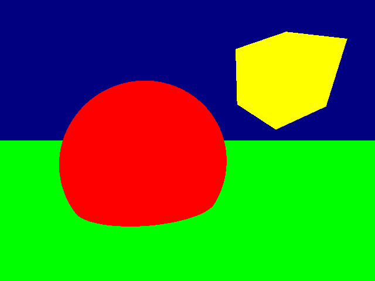

# Raytracing project

## Build

To build run 
```
./build.sh
```

## Run

To execute run 
```
./run.sh path_to_input_file path_to_output_file
```

## Output

Return image in NetPBM P6 format. Example:


